<!-- Source of truth for the profile README. scripts/render.mjs turns this into README.md and draws everything in assets/. Edit here and in profile.json, not in README.md. -->

  
  
  
  

  <a href="https://wcvmjs.com">wcvm</a> ·
  <a href="https://rectify-teams.github.io/rectify">Rectify</a> ·
  <a href="https://www.linkedin.com/in/duyduc-dev/">LinkedIn</a> ·
  <a href="https://calendly.com/dangduyducdangduyduc/30-minute-meeting">Book a chat</a> ·
  <a href="mailto:ducdangduy1908@gmail.com">Email</a>

## L0 · Surface

I like going one layer below the framework. Rectify reimplements the UI runtime (fiber reconciler, hooks, Suspense, router) in about 10 KB, and wcvm boots a real Node.js sandbox, with `npm install` and dev servers, entirely in the browser with no backend.

As of 2026-10-05, from the public GitHub and npm APIs. <a href="#l1--now">↓ One layer down: L1 · Now</a>

## L1 · Now

Hardening wcvm's Node compatibility (Vite, Next.js, SvelteKit, NestJS and more) and growing the Rectify ecosystem: router, Vite plugin and project scaffolding.

The toolbox I reach for

 

| Area | Tools |
| --- | --- |
| Frontend | React, Next.js, Tailwind, Material UI |
| Backend | Node, NestJS, Spring Boot, Laravel |
| Data | PostgreSQL, MongoDB, Redis |
| DevOps | Docker, Nginx, GitHub Actions |

<a href="#l2--ui-runtime">↓ One layer down: L2 · UI runtime</a>

## L2 · UI runtime

If you know React, you already know Rectify: the component model, hooks and JSX transform are intentionally compatible, with zero React dependencies. [Docs](https://rectify-teams.github.io/rectify).

  
  

The rest of the family

 

| Package | What it does |
| --- | --- |
| `@rectify-dev/core` | Runtime, JSX transform, hooks, class components, memo, lazy, Suspense, context. |
| `@rectify-dev/router` | Client-side router: BrowserRouter, HashRouter, nested routes and a full hook set. |
| `@rectify-dev/vite-plugin` | Vite plugin that wires up the JSX transform automatically. |
| `@rectify-dev/babel-transform-rectify-jsx` | Babel plugin for non-Vite environments. |

<a href="#l3--sandbox">↓ One layer down: L3 · Sandbox</a>

## L3 · Sandbox

Below the framework there is a runtime, and below the runtime there are syscalls and workers. Boot the first one at [wcvmjs.com](https://wcvmjs.com).

  

## Say hello

Working on browser runtimes, UI frameworks, or something that has to run without a server? [Email me](mailto:ducdangduy1908@gmail.com) or find me on [LinkedIn](https://www.linkedin.com/in/duyduc-dev/).

<code>$ sudo hire me</code>

 

Watch a snake eat my contribution graph

 

  <picture>
    <source media="(prefers-color-scheme: dark)" srcset="https://raw.githubusercontent.com/duyduc-dev/duyduc-dev/output/snake-dark.svg">
    
  </picture>

How this page is made

 

Every image here is an SVG drawn by [`scripts/render.mjs`](scripts/render.mjs): no GIFs, no JavaScript, no image service. Motion is CSS keyframes, and with reduced motion turned on everything rests on its final frame.

The numbers come from the public GitHub and npm APIs. A scheduled workflow re-renders the images and this README from `README.tmpl.md` and `profile.json`, and commits the result.

  <a href="#l0--surface">↑ Back to the surface</a>

